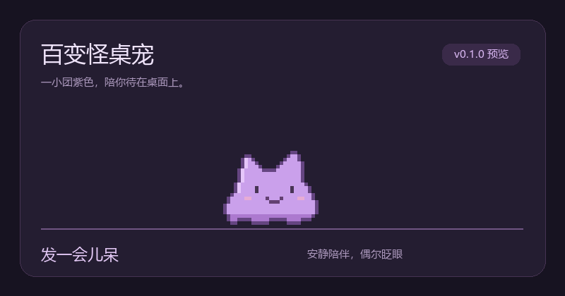

# 百变怪桌宠

一只安静待在 Windows 桌面上的像素百变怪。会眨眼、蠕动、被捏扁，也会在你放手后软软地落地。



**[下载 Windows 试运行版](https://github.com/HX-Jan/ditto-desktop-pet/releases)** · **[反馈问题](https://github.com/HX-Jan/ditto-desktop-pet/issues)**

> v0.1.0 是预发布版本。非官方同人作品，角色与商标权利归原权利人所有。

## 开始使用

在 Releases 下载 `DittoDesktopPet-v0.1.0-win-x64.zip`，完整解压后双击 **DittoDesktopPet.exe**。无需管理员权限，无需额外安装 .NET。压缩包中附有 `QUICKSTART.txt`。

面向 Windows 10/11 x64。实际验证范围与尚未实测项目见 [验证记录](docs/VALIDATION.md)。当前未做代码签名，Windows 可能显示未知发布者提示。

| 操作 | 效果 |
| --- | --- |
| 左键点击 | 压扁回弹；睡眠时唤醒 |
| 按住左键拖动 | 跟随鼠标并拉伸，松手后落到底部 |
| 右键桌宠或托盘图标 | 大小、暂停、睡眠、隐藏、退出 |
| 双击托盘图标／再次启动 | 找回隐藏的桌宠 |

默认安静置顶、无音效，不抢键盘焦点、不占任务栏按钮。透明区域可以点击后方窗口。桌宠在**主屏工作区底部**闲逛，不覆盖任务栏；菜单打开时停止运动。

三档大小为 96、128、160 逻辑像素（32 像素素材的 3、4、5 倍）。系统缩放为 125% 等非整数倍率时，物理像素可能略有不均匀，这是像素素材在分数缩放下的取舍。

暂停停止动画和运动，但仍可拖动；暂停时松手直接落到底部。隐藏停止动画计时。设置自动保存于 `%LOCALAPPDATA%\DittoDesktopPet\settings.json`；每次启动都可见且清醒。卸载时退出并删除解压目录即可，设置目录可另行删除。

## 首版边界

- 支持主屏；拖动不会跨到副屏。屏幕工作区变化时会把桌宠收回主屏可见范围。
- 暂无聊天、变身、喂养、声音、自启动、自动更新、联网或数据收集。
- 暂无独占全屏避让；需要时可通过托盘隐藏。
- 文档动图由应用的真实像素动画帧组成，是动作演示，不是桌面录屏。

## 开发与检查

安装 `global.json` 指定的 .NET 10 SDK，在 Windows 上运行：

```powershell
dotnet run --project src/Ditto.Desktop
dotnet run --project tests/Ditto.Tests -c Release
./tools/package.ps1
```

`Ditto.Core` 管理状态、运动及设置，不依赖桌面；`Ditto.Desktop` 负责 WPF 窗口、托盘、原生互操作和像素渲染。测试为无第三方依赖的控制台验收程序，失败会以非零退出码结束。

桌面集成检查需要交互式 Windows 会话：

```powershell
./artifacts/publish/DittoDesktopPet.exe --smoke-test --output artifacts/smoke
./artifacts/publish/DittoDesktopPet.exe --soak-test --output artifacts/soak
```

检查模式使用独立实例和临时设置，不覆盖日常设置。`--soak-test` 持续 30 分钟，完成后自动退出并生成结果。`--export-demo --output artifacts/frames` 导出真实动画帧，`python tools/create_demo.py` 生成文档动图（需要 Pillow）。GitHub Actions 在每次推送运行核心检查和打包，版本标签触发预发布。

## 许可

代码采用 [MIT](LICENSE)，美术素材及角色权利单独说明于 [ASSETS.md](ASSETS.md)。本项目不代表官方，不使用从官方游戏提取的素材。
